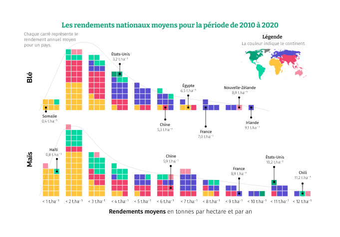
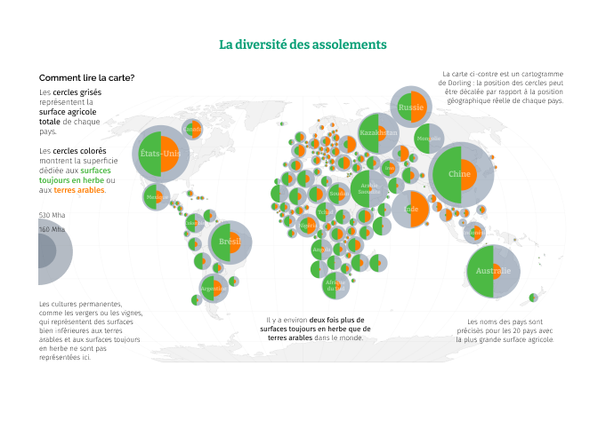

```{r setup, include=FALSE}
knitr::opts_chunk$set(echo = TRUE)
```

<br>
My name is Benjamin Nowak and I am a lecturer in agronomy at <b><a href="https://www.dunod.com/sciences-techniques/memo-visuel-d-agronomie-enjeux-et-defis-agriculture-expliques-en-100">VetAgro Sup</a></b>, a French institute that trains veterinarians, agricultural engineers, and veterinary public health inspectors. 
<br><br>
In the book <b><a href="https://www.dunod.com/sciences-techniques/memo-visuel-d-agronomie-enjeux-et-defis-agriculture-expliques-en-100">Mémo visuel d'agronomie</a></b> I present various agronomy concepts, illustrated by 100 data visualizations. This website is designed to teach you how to reproduce some of the book's illustrations, which were mainly **created with R**.
<br><br>
<b><center><span style="color:#F0426B">Click on a data visualization below to see how it was created !</span></center></b>

<head>
<style>
.hideextra {white-space: nowrap; overflow: hidden; text-overflow:ellipsis; }
</style>
</head>

<table style="width: 100%">

<tr>
  <td>
  <div class="hideextra" style="width:100%">
  <a href="https://bjnnowak.github.io/memo_agro/yield_gap"></img></a>
  </div>
  </td>

  <td>
  <div class="hideextra" style="width:100%">
  <a href="https://bjnnowak.github.io/memo_agro/dorling_cartogram"></img></a>
  </div>
  </td>
  
</tr>
  

</table>


<br>


